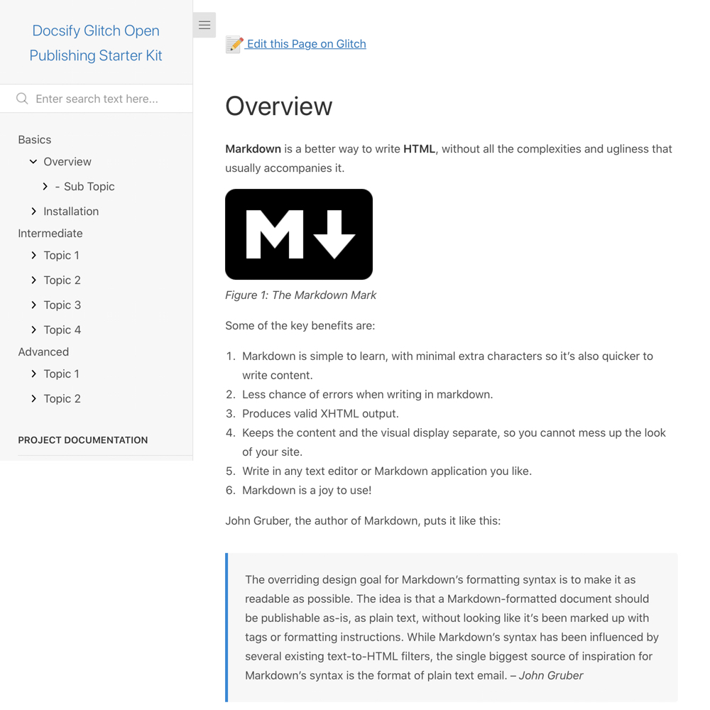

# Docsify Glitch Open Publishing Starter Kit

> This is a starter kit to create an open [Docsify](https://docsify.js.org) documentation site on [Glitch](https://glitch.com/), with a link automatically created on each page to edit the source Markdown text on Glitch.

📸 Docsify Glitch Open Publishing Screenshot
---

_Figure 1. Docsify Glitch Open Publishing Starter Kit. Explore a demo at [paulhibbitts-glitch-docsify-open-publishing-starter-kit.glitch.me/#/](https://paulhibbitts-glitch-docsify-open-publishing-starter-kit.glitch.me/#/)_

🚀 Quick Glitch Install Instructions
---
**Pre-flight Checklist**  

1. Glitch account

**Installation Steps**  

1. Copy the Git address of this GitHub repository (https://github.com/paulhibbitts/docsify-glitch-open-publishing-starter-kit.git)
2. Create a new Glitch Project, select **Import from GitHub** , and paste the Git address previously copied to your clipboard
3. And you're done! (view your new site using the the **Show** button)

📝 "Edit the Page on Glitch" Link Setup
---

1. Edit the file `index.html` in your Glitch files
2. Find the sample GitHub repository URL `'https://glitch.com/edit/#!/paulhibbitts-glitch-docsify-open-publishing-starter-kit'` and replace it with your own repository URL, for example `'https://glitch.com/edit/#!/your-glitch-project-name'`
3. Save your changes.

📚 Learn More about Docsify
---
[Docsify Documentation](https://docsify.js.org/#/?id=docsifyg)

🙇‍Credits and Special Thanks
---
[Glitch](https://glitch.com/)
[Docsify Themeable](https://github.com/jhildenbiddle/docsify-themeable)  
